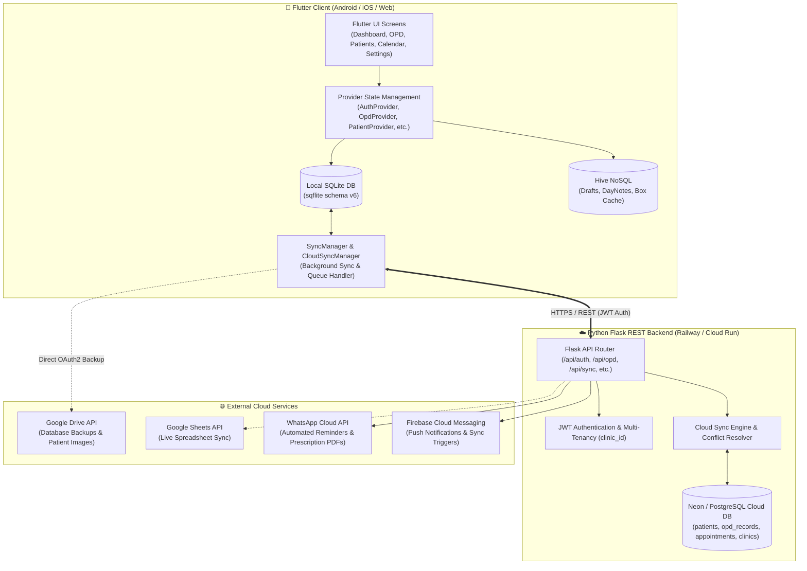
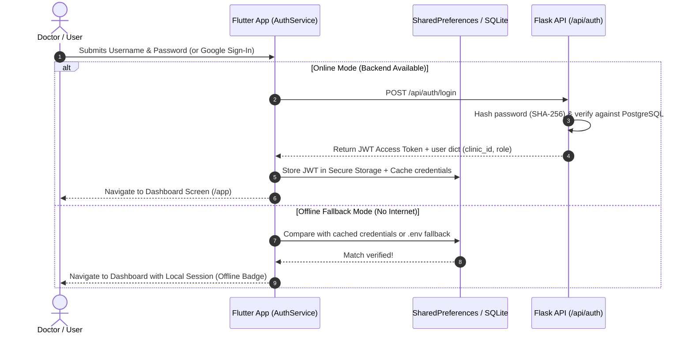

# 🩺 MediHive: Complete Developer & Intern Onboarding Guide

Welcome to the **MediHive** engineering project! 🚀 

This comprehensive guide is designed to take you from a complete beginner to understanding every single architectural decision, workflow, data model, backend API, sync engine, authentication flow, and frontend component across the entire repository.

---

## 📑 Table of Contents

1. [High-Level Overview & Core Philosophy](#1-high-level-overview--core-philosophy)
2. [High-Level System Architecture Diagram](#2-high-level-system-architecture-diagram)
3. [Technology Stack](#3-technology-stack)
4. [Project Directory Structure](#4-project-directory-structure)
5. [Authentication & Authorization](#5-authentication--authorization)
6. [Database Architecture (Local SQLite vs Cloud PostgreSQL)](#6-database-architecture)
7. [The Synchronization Engine (Offline-First Deep Dive)](#7-the-synchronization-engine-offline-first-deep-dive)
8. [Core Feature Workflows](#8-core-feature-workflows)
   - [OPD Queue & Registration](#81-opd-queue--registration-workflow)
   - [Patient Management & Medical History](#82-patient-management--history)
   - [Prescription Generation & PDF Printing](#83-prescription-generation--pdf-printing)
   - [Appointments & Calendar Notes](#84-appointments--calendar-notes)
   - [Marathi & English Localization (i18n)](#85-marathi--english-localization)
   - [Backup, Restore & Google Drive/Sheets Integration](#86-backup-restore--google-integrations)
9. [Backend APIs & Services Deep Dive](#9-backend-apis--services-deep-dive)
10. [Local Development Setup & Debugging Guide](#10-local-development-setup--debugging-guide)
11. [Common Pitfalls & Pro-Tips for Interns](#11-common-pitfalls--pro-tips-for-interns)

---

## 1. High-Level Overview & Core Philosophy

### What is MediHive?
**MediHive** is a full-featured Clinic and Hospital Management System (specifically tailored for Ayurvedic, General, and Specialist clinics in Maharashtra, India, with full Marathi and English language support). It enables doctors and clinic assistants to manage patient registrations, Outpatient Department (OPD) queues, prescriptions, billings, Panchakarma treatments, and appointments.

### Core Philosophy: **Offline-First Resilience**
Clinics in suburban and rural areas frequently suffer from intermittent or non-existent internet connections. Therefore, MediHive is engineered with an **Offline-First Architecture**:
1. **Never block the doctor**: The mobile app reads and writes exclusively to a **local SQLite database** with instant UI response time (zero network lag).
2. **Eventual Consistency**: Background sync workers (`SyncManager`, `CloudSyncManager`, and `Workmanager`) asynchronously reconcile local mutations with the remote PostgreSQL cloud server when connectivity is available.
3. **Multi-device sync**: When multiple devices (e.g., receptionist tablet and doctor tablet) operate in the clinic, changes merge seamlessly using a timestamp-based **Last-Write-Wins (LWW)** and transaction log mechanism.

---

## 2. High-Level System Architecture Diagram



---

## 3. Technology Stack

| Layer | Technology | Key Libraries / Packages |
| :--- | :--- | :--- |
| **Frontend Framework** | Flutter (Dart SDK ^3.8.0) | `provider`, `go_router`, `flutter_localizations` |
| **Local Data Storage** | SQLite & Hive | `sqflite`, `hive_flutter`, `shared_preferences` |
| **UI Components & Charts** | Material 3 & Google Fonts | `fl_chart`, `google_fonts`, `table_calendar` |
| **Document Generation** | PDF & Printing | `pdf`, `printing`, `excel`, `share_plus` |
| **Background Tasks** | Workmanager | `workmanager`, `flutter_local_notifications` |
| **Backend Framework** | Python 3.10+ / Flask | `flask`, `flask_jwt_extended`, `flask_cors`, `gunicorn` |
| **Cloud Database** | PostgreSQL | `psycopg2-binary`, hosted on Neon / Railway |
| **Third-Party APIs** | Google & Meta | `googleapis`, `google_sign_in`, WhatsApp Cloud API |

---

## 4. Project Directory Structure

```text
MediHive-Flutter Marathi/
├── lib/                                  # 📱 Flutter Frontend Core
│   ├── database/                         # SQLite database helpers & schemas
│   │   ├── database_helper.dart          # SQLite singleton, table creation, migrations
│   │   └── schema.dart                   # Schema definitions & DDL statements (version 6)
│   ├── l10n/                             # Localization files (English & Marathi ARB files)
│   │   ├── app_en.arb                    # English translation strings
│   │   ├── app_mr.arb                    # Marathi (मराठी) translation strings
│   │   └── app_localizations.dart        # Auto-generated localization delegate
│   ├── models/                           # Dart data models & Hive TypeAdapters
│   │   ├── patient.dart / patient_model.dart
│   │   ├── opd_record_model.dart / opd_form_data.dart
│   │   ├── appointment_model.dart
│   │   └── prescription.dart
│   ├── providers/                        # State management (ChangeNotifiers)
│   │   ├── auth_provider.dart            # User session, login state, 2FA state
│   │   ├── opd_provider.dart             # OPD queue, form handling, visit creation
│   │   ├── patient_provider.dart         # Patient search, records CRUD
│   │   ├── appointment_provider.dart     # Calendar events, appointments list
│   │   ├── dashboard_provider.dart       # Analytics, KPI metrics, chart figures
│   │   ├── settings_provider.dart        # Clinic metadata, dark mode, doctor info
│   │   ├── notification_provider.dart    # Reminders & system alerts
│   │   └── locale_provider.dart          # Language switching ('en' <-> 'mr')
│   ├── screens/                          # User Interface screens
│   │   ├── app_shell.dart                # Scaffold with persistent BottomNavigationBar
│   │   ├── auth/                         # Login, Register, 2FA Verification screens
│   │   ├── dashboard/                    # Overview, revenue charts, patient stats
│   │   ├── opd/                          # OPD Queue & OPD Registration screens
│   │   ├── patients/                     # Patient search, detail timeline, edit screen
│   │   ├── prescription/                 # Medicine prescription builder & PDF preview
│   │   ├── calendar/                     # Calendar view & appointment scheduling
│   │   ├── settings/                     # Doctor/Clinic profiles, theme toggle, backup
│   │   ├── help/                         # Help Center & FAQ
│   │   └── splash_screen.dart            # App boot, credentials load, route redirection
│   ├── services/                         # Business logic & external API connectors
│   │   ├── api_service.dart              # HTTP REST client for Flask backend
│   │   ├── auth_service.dart             # Login, register, Google Auth, session handling
│   │   ├── sync_manager.dart             # Primary bi-directional sync engine
│   │   ├── cloud_sync_manager.dart       # Periodic background cloud polling
│   │   ├── google_auth_service.dart      # Google OAuth2 client
│   │   ├── google_drive_sync_service.dart# Google Drive DB backup upload/download
│   │   ├── prescription_pdf_service.dart # PDF layout & Marathi font rendering
│   │   ├── excel_export_service.dart     # Export clinical data to Excel .xlsx
│   │   ├── excel_restore_service.dart    # Restore/import database from Excel
│   │   └── local_notification_service.dart# Scheduled system notifications
│   ├── theme/                            # Light/Dark ColorSchemes & Typography
│   └── main.dart                         # App initialization, GoRouter routes, providers
│
├── backend/                              # ☁️ Python Flask REST API
│   ├── app.py                            # Flask application factory & route blueprints
│   ├── config.py                         # Environment configuration & JWT secrets
│   ├── database.py                       # PostgreSQL connection pooling & schema DDL
│   ├── models/                           # Backend database entity models
│   ├── routes/                           # API Endpoints
│   │   ├── auth.py                       # /api/auth (login, register, register-clinic, me)
│   │   ├── patients.py                   # /api/patients (CRUD, search)
│   │   ├── opd.py                        # /api/opd (Visits CRUD, vital stats)
│   │   ├── appointments.py               # /api/appointments (Schedule, slots)
│   │   ├── sync.py                       # /api/sync (Batch push, delta pull, LWW conflict)
│   │   ├── cloud.py                      # /api/cloud (Cloud sync queue processing)
│   │   ├── settings.py                   # /api/settings (Doctor & clinic profile API)
│   │   └── whatsapp.py                   # /api/whatsapp (Cloud WhatsApp messaging)
│   └── services/                         # Background sync workers & Google Sheets hooks
```

---

## 5. Authentication & Authorization

MediHive uses a multi-layered authentication strategy that supports both cloud-connected multi-user clinics and offline single-doctor operations:



### Key Auth Concepts:
1. **Managed Single-Doctor Deployment Model**: The app is designed for direct provisioning by the company onto the doctor's phone/tablet with their pre-assigned `clinic_id` and credentials. Open self-registration is intentionally not exposed on the login screen to maintain a secure, pre-configured environment.
2. **Multi-Tenancy via `clinic_id`**: Every user and clinic entity is bound to a unique `clinic_id` (e.g. `CLI7F8A1B2C`). A doctor from Clinic A can never access records belonging to Clinic B.
3. **Role-Based Permissions**: Users have roles like `doctor` or `admin`.
4. **Google Sign-In**: Used primarily to authenticate Google Drive/Google Sheets sync capabilities while simultaneously binding to the backend user account.
5. **Two-Factor Authentication (2FA)**: OTP-based verification for password resets or enhanced security enabled in `auth_settings`.

---

## 6. Database Architecture

### Local SQLite Database (`lib/database/schema.dart` & `database_helper.dart`)
Runs on the device. Version: `7` (100% cloud parity).

| Table Name | Primary Key | Key Columns | Purpose |
| :--- | :--- | :--- | :--- |
| `patients` | `id` (INTEGER) | `sync_id`, `full_name`, `mobile_number`, `gender`, `dob`, `age`, `blood_group`, `clinic_id`, `sync_status`, `updated_at` | Stores patient master records |
| `opd_visits` | `id` (INTEGER) | `opd_id` (UUID), `patient_id`, `visit_datetime`, `diagnosis`, `symptoms`, `medicines` (JSON), `total_fee`, `panchakarma_notes` | Individual outpatient visit records |
| `calendar_notes`| `id` (INTEGER) | `note_date`, `note_text`, `created_at`, `updated_at` | Daily diary/notes on the calendar |
| `clinic_settings`| `id` (INTEGER)| `doctor_name`, `clinic_name`, `doctor_license_no`, `clinic_address`, `smtp_email` | Clinic letterhead and configuration |
| `users` | `id` (INTEGER) | `username`, `password_hash`, `email`, `reset_otp` | Local authenticated user accounts |
| `medicines` | `id` (INTEGER) | `name` (UNIQUE) | Autocomplete master list of medications |
| `symptoms_master`| `id` (INTEGER)| `name` (UNIQUE) | Autocomplete master list of clinical symptoms |
| `patient_images`| `id` (INTEGER)| `patient_id`, `opd_visit_id`, `file_path`, `drive_url` | X-rays, lab reports, clinical photos |
| `sync_queue` | `id` (INTEGER) | `entity_type`, `entity_id`, `operation`, `status`, `retry_count` | Queue for changes waiting to be pushed to cloud |
| `cloud_sync_queue`| `id` (INTEGER)| `table_name`, `operation`, `record_id`, `payload`, `sync_status`| Change-data-capture queue for real-time sync |
| `device_registration`| `id` (INTEGER)| `device_id` (UNIQUE), `fcm_token`, `app_version` | Device identifier for push sync notifications |

---

## 7. The Synchronization Engine (Offline-First Deep Dive)

The synchronization engine is one of the most sophisticated parts of the codebase. It resides in `lib/services/sync_manager.dart` and `backend/routes/sync.py`.

### How Push & Pull Work:
1. **Pushing Local Changes**:
   - When a patient or OPD record is created or updated locally, it is marked with `sync_status = 'pending'` and queued in `cloud_sync_queue`.
   - `SyncManager` bundles pending changes into an HTTP POST request to `/api/sync/push`.
   - The backend validates the records, applies them to PostgreSQL, and responds with a success status.
   - The local app marks the records as `sync_status = 'synced'` and updates `last_synced_at`.

2. **Pulling Remote Changes**:
   - `SyncManager` calls `GET /api/sync/pull?since=<last_synced_timestamp>&clinic_id=<clinic_id>`.
   - The backend returns all records modified by other devices since that timestamp.
   - The local SQLite database upserts these records using **Last-Write-Wins (LWW)**: if `remote.updated_at > local.updated_at`, local is updated.

3. **Trigger Mechanisms**:
   - **On App Resume**: `_AppLifecycleSyncObserver` triggers a quick sync as soon as the user opens or switches back to the app.
   - **Periodic Cloud Polling**: `CloudSyncManager` polls every 20 seconds when online.
   - **Manual Force Sync**: Tapping the sync button on the AppBar.
   - **Background Nightly Backup**: `Workmanager` triggers a daily backup task at 2:00 AM.

---

## 8. Core Feature Workflows

### 8.1 OPD Queue & Registration Workflow
1. **Queue View (`OpdQueueScreen`)**: Displays today's patient queue categorized into `Waiting`, `In Consultation`, and `Completed`.
2. **Registration (`OpdRegistrationScreen`)**:
   - Search for an existing patient by name or phone number, or create a new patient directly.
   - Enter Vitals: Weight, Blood Pressure, Pulse, Temperature.
   - Enter Symptoms & Complaints: Autocomplete populated from `symptoms_master` with Marathi language terms.
   - Clinical Diagnosis & Panchakarma Notes.
   - Prescribe Medicines: Add medication name, dosage (morning/afternoon/night), food timing (before/after food), and duration.
   - Billing Calculation: Consultation fee + Medicine fee + Panchakarma fee - Discounts = Total Fee.
   - Payment Mode: Cash, UPI, Card, Pending.
3. Save record -> Stores in `opd_visits` -> Direct option to generate Prescription PDF or share on WhatsApp.

### 8.2 Patient Management & History
- Screen: `PatientManagementScreen` & `PatientDetailsScreen`.
- Features: Instant search across thousands of records using SQLite indices, filter by age/gender/blood group.
- Patient Timeline: Complete medical history displaying all historical OPD visits chronologically, previous diagnoses, and prescriptions.

### 8.3 Prescription Generation & PDF Printing
- Service: `lib/services/prescription_pdf_service.dart`.
- Uses `pdf` and `printing` packages to generate standard A4 / Letter prescription sheets.
- Header contains Doctor's name, degree, license number, clinic address, and clinic logo.
- Medication table with clear visual icons for dosage schedules (☀️ Morning, 🌤️ Afternoon, 🌙 Night) and instructions in Marathi (उदा. जेवणानंतर / जेवणापूर्वी).
- Native printing support + 1-click WhatsApp PDF sharing (`whatsapp_share_helper.dart`).

### 8.4 Appointments & Calendar Notes
- Screen: `CalendarScreen` (powered by `table_calendar`).
- Doctors can click on any calendar day to see scheduled patient follow-ups or add private clinic notes stored in `calendar_notes`.
- Automated daily summaries:
  - Morning Summary (8:00 AM): Notification listing all patients scheduled for today.
  - Evening Summary (8:00 PM): Total patients seen today and revenue collected.

### 8.5 Marathi & English Localization (i18n)
- MediHive is localized using Flutter's official `gen-l10n` tool.
- Translation files: `lib/l10n/app_en.arb` (English) and `lib/l10n/app_mr.arb` (मराठी).
- `LocaleProvider` allows switching languages instantaneously anywhere in the app without restarting.

### 8.6 Backup, Restore & Google Integrations
- **Excel Export/Import**: Full database export to multi-sheet `.xlsx` files (`excel_export_service.dart`) and intelligent merge restore (`excel_restore_service.dart`).
- **Google Drive Backup**: Uploads encrypted SQLite database snapshots directly to the doctor's private Google Drive folder (`google_drive_sync_service.dart`).

---

## 9. Backend APIs & Services Deep Dive

The backend is built with Python Flask (`backend/app.py`). Here is the route reference:

```text
/api/auth
  POST /login             -> Authenticate user, return JWT + clinic_id
  POST /register          -> Register new doctor account
  POST /register-clinic   -> Register new clinic entity + admin account
  GET  /me                -> Get current authenticated user profile

/api/patients
  GET  /                  -> List / search patients with pagination
  POST /                  -> Create a new patient
  GET  /<id>              -> Get patient details + full visit history
  PUT  /<id>              -> Update patient demographics

/api/opd
  GET  /                  -> List OPD visits (filter by date, status, patient)
  POST /                  -> Create new OPD visit + prescription
  GET  /<id>              -> Get single OPD visit record
  PUT  /<id>              -> Update OPD visit record

/api/sync
  POST /push              -> Bulk push local SQLite changes to cloud
  GET  /pull              -> Delta pull remote changes since last timestamp
  POST /resolve           -> Resolve specific data conflict

/api/settings
  GET  /clinic            -> Retrieve clinic profile & doctor metadata
  PUT  /clinic            -> Update clinic settings & letterhead info

/api/whatsapp
  POST /send-reminder     -> Trigger appointment reminder via WhatsApp Cloud API
  POST /send-prescription -> Send PDF prescription link via WhatsApp
```

---

## 10. Local Development Setup & Debugging Guide

### Prerequisites
- **Flutter SDK**: 3.8.0 or higher (`flutter --version`)
- **Python**: 3.10+ with `pip`
- **Android Studio / VS Code**: With Flutter & Dart plugins
- **PostgreSQL**: (Optional for local backend testing, or connect to test cloud instance)

### 1. Frontend Setup (Flutter)
```bash
# 1. Clone & enter project
cd "d:/MediHive-Flutter Marathi"

# 2. Install Dart dependencies
flutter pub get

# 3. Create .env from template
cp .env.example assets/.env

# 4. Generate Hive TypeAdapters & code generation (if modifying models)
flutter pub run build_runner build --delete-conflicting-outputs

# 5. Run on Android Device / Emulator
flutter run

# (Optional) Run on Chrome for quick UI testing
flutter run -d chrome
```

### 2. Backend Setup (Flask)
```bash
cd backend

# 1. Create and activate virtual environment
python -m venv venv
# On Windows:
.\venv\Scripts\activate
# On Linux/macOS:
source venv/bin/activate

# 2. Install Python dependencies
pip install -r requirements.txt

# 3. Configure backend environment
cp .env.example .env

# 4. Start the development server
python app.py
# Server starts at http://localhost:8080
```

---

## 11. Common Pitfalls & Pro-Tips for Interns

> [!TIP]
> **1. The Golden Rule of Offline-First**: Never call `ApiService` directly from UI widgets! Always perform writes through the corresponding Provider (e.g., `PatientProvider`, `OpdProvider`), which writes to the local SQLite database first and lets `SyncManager` handle cloud synchronization.

> [!IMPORTANT]
> **2. Modifying SQLite Schemas**: If you add or alter tables in `lib/database/schema.dart`, remember to:
> - Increment `databaseVersion` in `schema.dart`.
> - Add migration logic in `lib/database/database_helper.dart` under `onUpgrade`.

> [!WARNING]
> **3. Marathi Font Rendering in PDFs**: If you add new Marathi glyphs or complex characters to PDF generation, ensure the font file loaded in `prescription_pdf_service.dart` supports Devanagari Unicode ranges (Noto Sans Devanagari / Tiro Devanagari Marathi).

> [!NOTE]
> **4. Model Serialization**: Whenever you modify any model file with `@HiveType` or `@JsonSerializable`, you must re-run:
> ```bash
> flutter pub run build_runner build --delete-conflicting-outputs
> ```

---

🎉 **You are now fully equipped to build, debug, and extend MediHive! Happy coding!**
